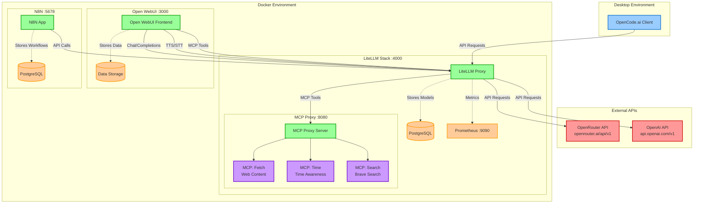

# My Self-Hosted Stack

This repository contains a Docker-based infrastructure stack that supports two use cases:

- A unified LLM API gateway using LiteLLM, integrated with Open WebUI for web-based interaction, N8N for workflow automation, and support for desktop clients like OpenCode.ai. The stack routes requests to external LLM providers (OpenRouter, OpenAI) and exposes MCP tools for enhanced functionality.

- Immich for self-hosted photo and video management with AI-powered features.

Everything is running behind an nginx reverse proxy with automatic SSL certificate management and Watchtower for automated container updates.

## Base Infrastructure Components

This section covers the foundational infrastructure services that support the entire stack.

### nginx-proxy

A reverse proxy setup with automatic SSL certificate management and dynamic configuration.

**Components:**

- **nginx** (Ports 80, 443): Alpine-based reverse proxy
  - Routes incoming HTTP/HTTPS traffic to backend services
  - Automatic SSL/TLS termination

- **docker-gen**: Dynamic configuration generator
  - Monitors Docker events
  - Automatically generates nginx configurations based on running containers
  - Triggers nginx reload on configuration changes

- **acme-companion**: SSL certificate management
  - Automatically obtains and renews Let's Encrypt certificates
  - Handles certificate storage and renewal

**Network:**

- Creates and manages the `nginx-proxy` external network used by other services

**Configuration:**

- Custom `client_max_body_size.conf` for upload size limits
- Custom nginx template in `nginx.tmpl`

### Watchtower

Automated Docker container update service.

**Configuration:**

- **Schedule**: Daily at 6:00 AM (`0 0 6 * * *`)
- **Cleanup**: Automatically removes old images after updates
- Monitors all containers for image updates
- Performs rolling updates to minimize downtime

## LLM Infrastructure Stack

### System Architecture Diagram

## Components

### **LiteLLM Stack**

- **LiteLLM Proxy** (Port 4000): Central API gateway for LLM requests
  - Routes requests to OpenRouter and OpenAI
  - Manages model configuration in PostgreSQL
  - Provides MCP tools
  - Exports metrics to Prometheus

- **MCP Proxy** (Port 8080): Hosts MCP servers
  - **Fetch**: Web content fetching
  - **Time**: Time awareness
  - **Search**: Brave web search

### **Open WebUI** (Port 3000)

- Frontend for LLM interaction
- Uses LiteLLM as backend (`litellm-app-1:4000`)
- TTS/STT via LiteLLM
- Accesses MCP tools via LiteLLM

### **N8N** (Port 5678)

- Workflow automation platform
- Can use LiteLLM for LLM-based workflows
- Dedicated PostgreSQL database for workflows

## Immich Photo Management

Self-hosted photo and video management solution with AI-powered features.

**Components:**

- **Immich Server** (Port 2283): Main application server
  - Web interface for photo/video management
  - REST API for client applications
  - Connected to nginx-proxy for external access

- **Machine Learning**: AI-powered features
  - Face recognition
  - Object detection
  - Smart search capabilities
  - Model cache for improved performance

- **Redis/Valkey 8**: Caching and job queue
  - Background task processing
  - Session management

- **PostgreSQL 14**: Database with vector extensions
  - Uses vectorchord 0.4.3 and pgvectors 0.2.0
  - Optimized for ML embeddings storage

**Storage:**

- **Library**: CIFS/SMB network share
  - Stores uploaded photos and videos
  - Configurable location via `CIFS_UPLOAD_LOCATION_*` variables
  - Mounted with full permissions (777)

- **Model Cache**: Local Docker volume
  - Stores ML models for faster loading

**Network Integration:**

- Connected to `nginx-proxy` network for external access
- Internal network for service communication
